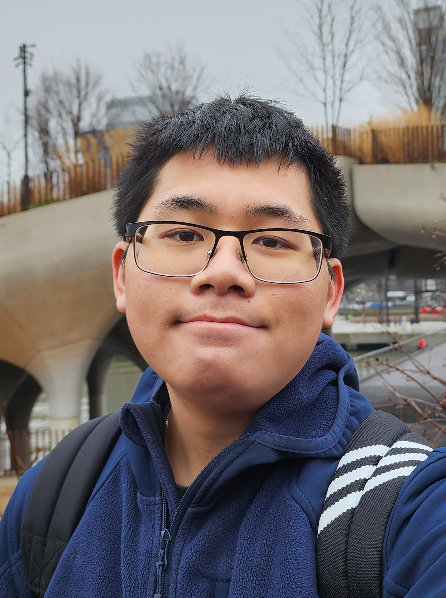

---
# Feel free to add content and custom Front Matter to this file.
# To modify the layout, see https://jekyllrb.com/docs/themes/#overriding-theme-defaults
title: /home
layout: home
permalink: /
---

**Welcome to my website!**

Hey there! I'm Kevin Shi, a Virginia native and third year CS major at the University of Virginia. I do a lot of different things, but here are some of the highlights:

# Professional Experience
- Google: SWE Intern (May 2025 - Present)
- Northrop Grumman: SWE Intern (May 2024 - July 2024)
- OmnisTMS: SWE Intern (June 2024 - August 2024)

# Personal Hobbies
- Go to the <a href="/random/" class="flashing" rel="noopener noreferrer">/random</a> page
# Full Resume <a href="../assets/Kevin_Shi_resume_np.pdf" target="_blank" rel="noopener noreferrer">Here</a>
# ‎ 

  

